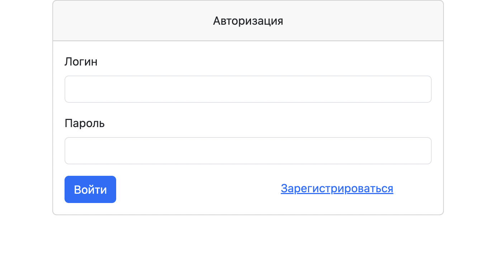
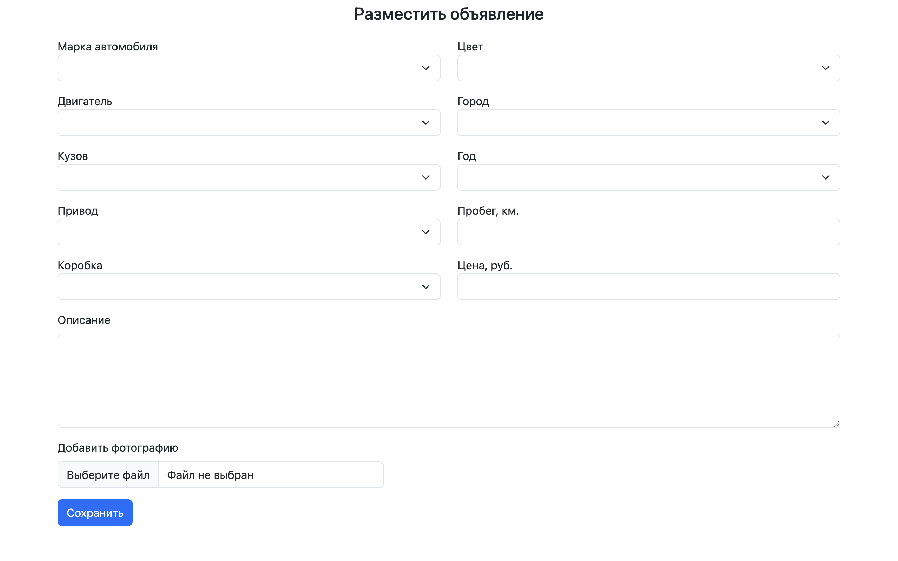
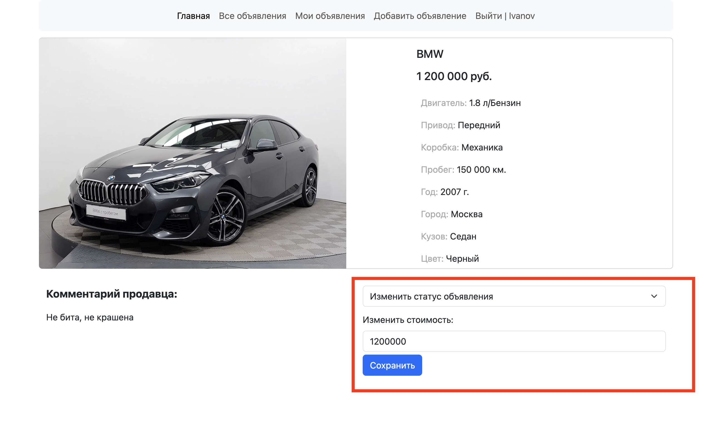

#job4j_cars

# Cars
## О проекте:

Данный проект является учебным и представляет собой площадку
по продаже автомобилей. На площадке возможно размещать свои
объявления и просматривать объявления других пользователей
о продаже. Проект строится на базе Spring Framework и Hibernate.
Для работы с базой данных используется Liquibase.

## Стек технологий:

+ Java 17
+ Spring Boot 2.7
+ Hibernate 6.1, 
+ Mockito 4.7, JUnit 5.8
+ Maven 
+ PostgreSQL, Liquibase, h2(h2database)
+ Lombok

## Запуск приложения:

Для успешного запуска проекта на вашем компьютере
должно быть установлено:
- JDK 17(+)
- Maven
- PostgreSql
- Git

Процесс установки:
1. Скачайте проект к себе на компьютер, используя команду:  
   `git clone https://github.com/PavelM2205/job4j_cars.git`.
2. В PostgreSQL создайте базу данных с именем "cars_db".
3. Добавьте свои данные "db.username" и "db.password" для доступа к базе данных в файле  
   `pom.xml`:
    ```
   <profile>
      <id>production</id>
      <properties>
        <db.url>jdbc:postgresql://127.0.0.1:5432/cars_db</db.url>
        <db.username>postgres</db.username>
        <db.password>password</db.password>
        <db.driver>org.postgresql.Driver</db.driver>
      </properties>
    </profile>
    ```    
   а также "hibernate.connection.username" и "hibernate.connection.password"
   в файле `src/main/resources/hibernate.cfg.xml`.
4. Перейдите в директорию проекта и выполните команду:  
   `mvn install -Pproduction -Dmaven.test.skip=true`.
5. Запустите приложение, используя команду:  
   `mvn exec:java -Dexec.mainClass=ru.job4j.cars.Main`.
6. После запуска приложение будет доступно по адресу:
   http://localhost:8080/index .

## Использование:

На главной странице отображаются все объявления о продаже


При переходе в карточку объявления, становится доступна
полная информация об автомобиле, а также описание от 
продавца.


Добавить объявление возможно только после авторизации.


После авторизации появляется возможность просматривать
все свои объявления


добавлять новые объявления



а также изменять стоимость и статус объявления.


